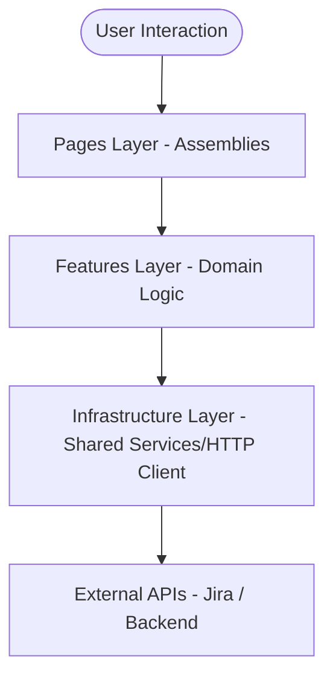

# Architectural Documentation

This project enforces a **Feature-Driven Modular Architecture**. 
Logical layers are strictly isolated to ensure scalability, testability, and clear separation of concerns.

## Data Flow Overview

## Folder Breakdown

1.  **`src/app/`**: Contains global setups. These include root Providers, core routers, global config assemblies, and standard wrappers.
2.  **`src/core/`**: Shared primitives and reusable foundations.
    *   `components/`: Raw presentation primitives (Skeletons, Spinners, Error Boundaries).
    *   `hooks/`: Reusable react hooks (`useDebounce`, `useLocalStorage`).
    *   `utils/`: Generic javascript helpers (storage wrappers, date formatters).
    *   `constants/`: Shared static definitions (routes, storage keys, regex).
    *   `types/`: Generic typescript types (`ApiResponse`, `Pagination`, `ErrorResponse`).
    *   `lib/`: Core service engines (e.g. `logger.ts`).
    *   `config/`: Validated configurations (`app.config`, `query.config`, `axios.config`).
3.  **`src/infrastructure/`**: External communication adapters. Handled exclusively using Axios (`httpClient` instance) and custom response interceptors. This layer defines the pipeline but is independent of domain business logic.
4.  **`src/features/`**: The main business layer. Features are self-contained domains.
5.  **`src/pages/`**: Standard assemblies of features into route destinations. Pages contain layout styling, meta tags, and route parameters, but delegate business tasks to features.
